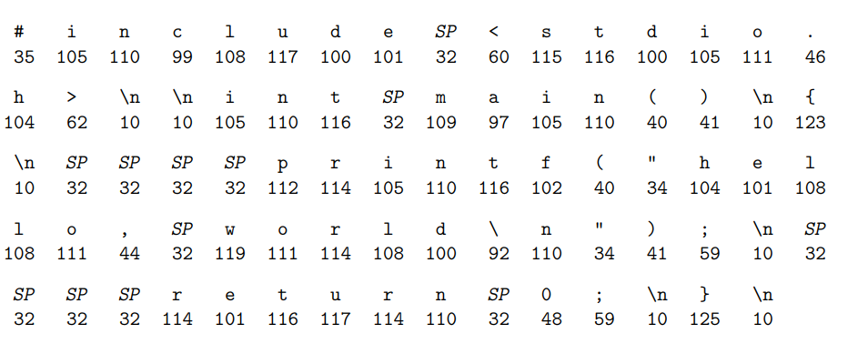
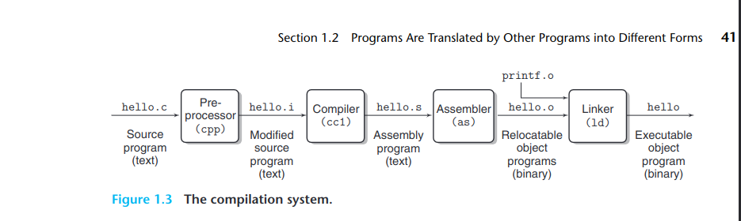
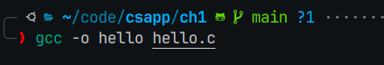
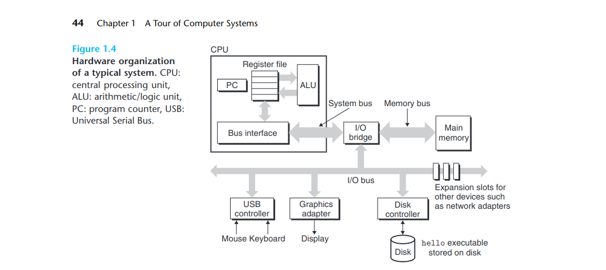

## Infomation is bits and context

又回到了这章，熟悉的开始，这次挑战英文版

```c
#include<stdio.h>

int main() {
    printf("hello, world!\n");
    return 0;
}
```

The representation of hello.c illustrates a fundamental idea: All information in a system is represented as a bunch of bits;

## Programs Are Translated by Other Programs into Different Forms



the compilation system. 



gcc compile the text file to object executable program by -o args;

The programs that perform the four phases:

### preprocessor phase 


Modified source program to .i text file, in this phase, preprocessor modify the original C program according to directives that begin with the 
'#' character; For example, the #include<stdio.h> command in line 1 of hello.c tells the preprocessor to read the contents of the system head file stdio.h and insert it dircetly 
into the program text.(only insert .h but not insert .cpp before linker ?)

### Compilation phase

The compiler translates the text file hello.i into the text file hello.s, whih contains an assembly-language program.
```s
main:
    subq $8, %rsp
    movl $.LC0, %edi
    call puts
    movl $0, %eax
    addq $8, %rsp
    ret
```

### Assembly phase

the assember translates hello.s into machine language instructions, packages them in a form known as relocatable object program, ans stores the result in the object file hello.o;(so,x86 machine language is closed? or riscv)

### linking phase

In Assembly phase , we get hello.o, but we import a c library, it 
repered a cpp file -printf.cpp.
so pre phase, we get 2 object 
programs.In linking phase, we will link printf.o into hello.o,
and get a executable that is ready to be loaded into memory and executed by the system.

## It Pays to Understand How Compilation Systems Work

There are some important reason why programmers need to understand how compilation systems work :
### Optimizing program performance

### Understanding link-time errors

### Avoiding security holes

## Processors Read and Interpret Instructions Stored in Memory

disk -> vfs -> fs -> shell -> user


### Hardware Organization of a System

Hardware organization of a typical system


This particular picture is modeled after he family of recent Intel systems, but all sysyems have a similar look and feel.

#### Buses

Runing throughout the system is a collection of electrical conduits called buses that carry bytes of information back and forth between the components.Buses are typically designed to transfer fixed-size chunks
of bytes known as words;

#### I/O Devices

Input/output device are the system's coection to the external world. 

Each I/O device is connected to the I/O bus by either a controller or an adapter.

controller: the chip sets in the device itself or on the motherboard.

adapter: it's a card that plugs into slot on the motherboard.

Chapter 6 and chapter 10 will to say more about I/O devices information.


#### Main Memory

The main memory is a temporary storage device that holds bath a program and trhe data it manipulates while the processor is execuring the program.

Physically, main memory conists of  a collection of dynamic random access memory (DRAM,动态随机访问内存) chips.

Logically, memory is organized as a linear array of bytes, each with its own unique address(array index) starting at zero. 

### Processor 

The central processing unit, or simply processor, is the engine that interpets(excutes) 